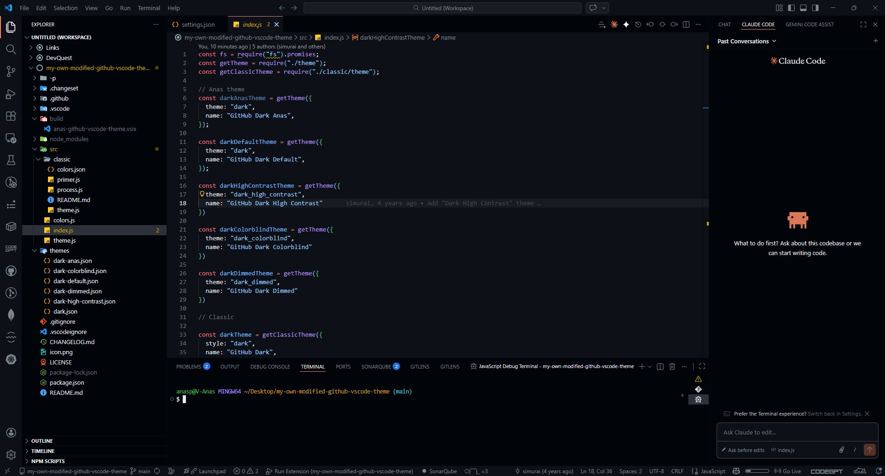

 # Dark Reign Theme for VS Code

 A modern, high-contrast dark theme inspired by GitHub Dark, with personal customizations for a sleek coding experience.

 

 ## Features
 - True dark mode for comfortable coding
 - Enhanced syntax highlighting for readability
 - Minimal, distraction-free UI
 - Based on GitHub Dark, with unique tweaks

 ## Installation

 ### From Marketplace
 1. Search for "Dark Reign Theme" in the Extensions view.
 2. Click Install.
 3. Open the Command Palette (`Ctrl+Shift+P`), search for `Color Theme`, and select **GitHub Dark Anas**.

 ### Manual (.vsix)
 1. Download the latest `.vsix` from the [build/](build/) directory or generate your own.
 2. In VS Code, open the Command Palette (`Ctrl+Shift+P`), type `Extensions: Install from VSIX...`, and select your `.vsix` file.
 3. Set the theme as above.

 ## Customization
 - Edit the JSON files in the `themes/` directory for advanced tweaks.
 - Only dark themes included; light variants removed for focus.

 ## Contributing
 Contributions, feedback, and suggestions are welcome! Fork the repo, make your changes, and submit a pull request.

 ## License
 MIT
